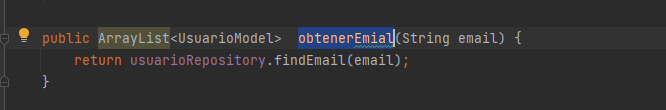
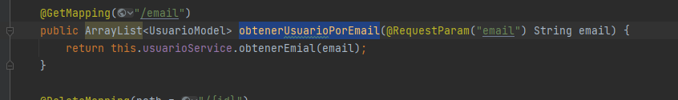
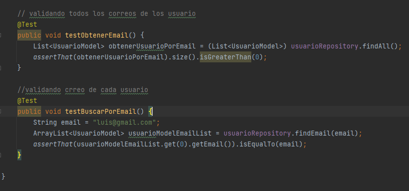
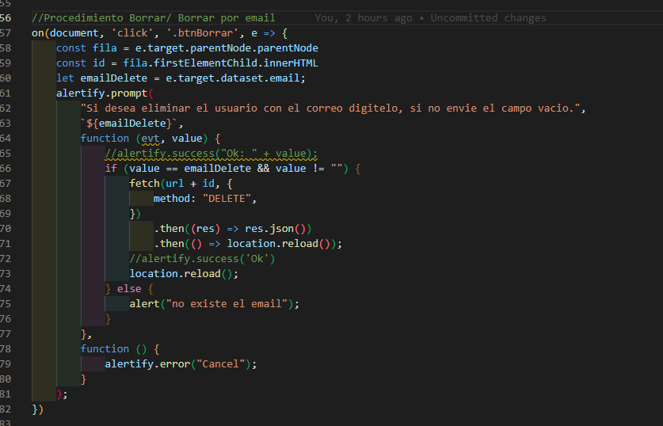
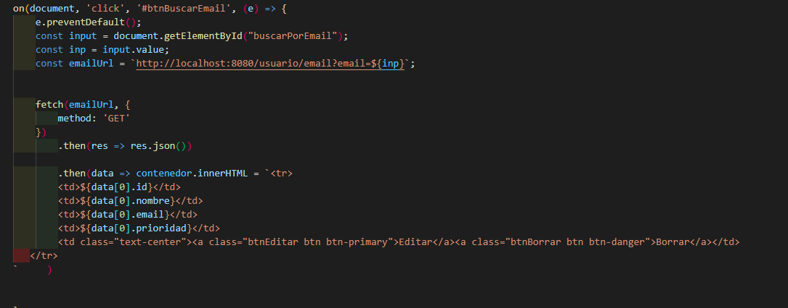
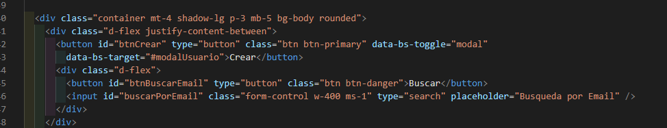

se realizo en el apicativo una opcion de busqueda de correo personalizado y la eliminacion por correo.  

 

  

Se realizan test al obtener correo de los usuarios.
 

//Procedimiento Borrar/ Borrar por email
  

//console.log('OPCION Buscar email')
  

Agregando boton y input para la busqueda de correo
